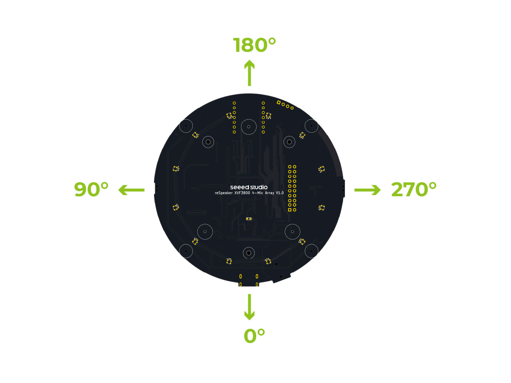

# How to control reSpeaker XVF3800

The reSpeaker XVF3800 is equipped with a control interface that allows users to configure the device's operation, set or read parameter data and save parameter data on the device. Users can control the device via the USB or I2C interface. A sample host application, `xvf_host` (for Linux, macOS, and Raspberry Pi OS) or `xvf_host.exe` (for Windows), is provided to easily connect to the control interface of the reSpeaker XVF3800.

## Introducing xvf_host

The sample host application `xvf_host` can be found in the `host_control/<platform>/` subdirectory of this repository. Supported platforms include linux_x86_64, mac_x86_64, mac_arm64, rpi_32bit, rpi_64bit, and win32. The entire directory needs to be transferred to the host computer and can be placed anywhere convenient. This directory should contain the following files:

```
.
├── (lib)command_map.(so/dll/dylib) # All platforms
├── libdevice_i2c.so                # RPi only
├── libdevice_spi.so                # RPi only
├── dfu_cmds.yaml                   # RPi only
├── transport_config.yaml           # RPi only
├── (lib)device_usb.(so/dll/dylib)  # All platforms
├── libusb-1.0.0.dylib              # mac_x86_64 and mac_arm64 only
├── xvf_i2c_dfu                     # RPi only
└── xvf_host(.exe)                  # All platforms
```

To verify the installation of the xvf_host application, navigate to the directory and run the application as shown in the examples below. On Windows:
```
xvf_host.exe --help
```

On Linux, macOS, and Raspberry Pi OS, appropriate permissions must be set first:
```
sudo chmod +x xvf_host
sudo ./xvf_host --help
```

## Accessing reSpeaker XVF3800

After connecting the reSpeaker XVF3800 to the host device(e.g. Windows PC) via USB (or I2C for RPi), run the following command to verify that the host application can access the control interface of the reSpeaker XVF3800:
```
./xvf_host(.exe) VERSION
// or use other specific control protocol, like i2c, spi, usb
./xvf_host(.exe) --use i2c VERSION  
```
This command should return the software version of the reSpeaker XVF3800, like:
```
./xvf_host VERSION   
Device (USB)::device_init() -- Found device VID: 10374 PID: 26 interface: 3
VERSION 2 0 2 
```

## Introducing Control Commands

### LED Control
These Commands Control the WS2812 LED Ring of the reSpeaker XVF3800.

| Command name   | Read/Write | Params | Param format | Description                                                                                            |
|----------------|------------|--------|--------------|--------------------------------------------------------------------------------------------------------|
| LED_EFFECT     | RW         | 1      | uint8_t      | Set the LED effect mode, 0 = off, 1 = breath, 2 = rainbow, 3 = single color, 4 = doa                   |
| LED_BRIGHTNESS | RW         | 1      | uint8_t      | Set the brightness value of the LED for the breath and rainbow mode                                    |
| LED_GAMMIFY    | RW         | 1      | uint8_t      | Set to enable gamma correction, 0 = disable, 1 = enable                                                |
| LED_SPEED      | RW         | 1      | uint8_t      | Set the effect speed of breath and rainbow mode                                                        |
| LED_COLOR      | RW         | 1      | uint32_t     | Set the LED color of breath mode and single color mode                                                 |
| LED_DOA_COLOR  | RW         | 2      | uint32_t     | Set the LED color of doa mode, the first value is the base color and the second value is the doa color |

By default, reSpeaker XVF3800 runs `rainbow` mode when boot, and then switch to `doa` mode after 2seconds. Here is an example to set a `breath` mode:
```
./xvf_host led_effect 1
./xvf_host led_color 0xff8800
./xvf_host led_speed 1
./xvf_host led_brightness 255
```

### Save Configuration

These commands are for saving/clearing all the writable parameters on the reSpeaker XVF3800.

| Command name        | Read/Write | Params | Param format | Description                                                                                  |
|---------------------|------------|--------|--------------|----------------------------------------------------------------------------------------------|
| SAVE_CONFIGURATION  | RW         | 1      | uint8_t      | Set to any value to save the current configuration to flash.                                 |
| CLEAR_CONFIGURATION | RW         | 1      | uint8_t      | Set to any value to clear the current configuration and revert to the default configuration. |

Here are the examples to save/clear configuration:
```
// To save configuration
./xvf_host save_configuration 1
// To clear configuration, send the following command, and reboot the reSpeaker XVF3800
./xvf_host clear_configuration 1
```

### GPIO Control

There are 3 input pins and 5 output pins that can be controlled on the reSpeaker XVF3800. Some of them can be used to control the LEDs, amplifier, microphones and the rest of them are floating. You can connect them to your own circuit if you want.

| Pin Name | Description                                                                                                                         | Direction | Read/Write  |
|----------|-------------------------------------------------------------------------------------------------------------------------------------|-----------|-------------|
| X1D09    | The state pin connected to the mute button, which is high level when the mute button is released                                    | Input     | Read Only   |
| X1D13    | Floating pin                                                                                                                        | Input     | Read Only   |
| X1D34    | Floating pin                                                                                                                        | Input     | Read Only   |
| X0D11    | Floating pin                                                                                                                        | Output    | RW          |
| X0D30    | The control pin of the microphone's mute circuit and the red mute LED, set this high to mute microphones and light the red mute led | Output    | RW          |
| X0D31    | The enable pin of the audio amplifier, enabled by low level                                                                         | Output    | RW          |
| X0D33    | The power control pin of WS2812 LEDs, enabled by high level                                                                         | Output    | RW          |
| X0D39    | Floating pin                                                                                                                        | Output    | RW          |

These commands are used to control the GPIO pins of the reSpeaker XVF3800.

| Command name    | Read/Write | Params | Param format | Description                                                                                     |
|-----------------|------------|--------|--------------|-------------------------------------------------------------------------------------------------|
| GPI_READ_VALUES | Read Only  | 3      | uint8_t      | Get current logic level of all GPI pins, in order of Pin X1D09, X1D13 and X1D34.                |
| GPO_READ_VALUES | Read Only  | 5      | uint8_t      | Get current logic level of all GPO pins, in order of Pin X0D11, X0D30, X0D31, X0D33 and X0D39.  |
| GPO_WRITE_VALUE | Write Only | 2      | uint8_t      | Set current logic level of selected GPO pin. Supports Pin X0D11, X0D30, X0D31, X0D33 and X0D39. |

Here are some examples of using GPIO control commands:

1. **Read GPI values**
```bash
./xvf_host GPI_READ_VALUES 
Device (USB)::device_init() -- Found device VID: 10374 PID: 26 interface: 3
GPI_READ_VALUES 1 0 0
```
In this example, the return `1 0 0` means that Pin X1D09 is high level, Pin X1D13 is low level and Pin X1D34 is low level.

2. **Read GPO values**
```bash
./xvf_host GPO_READ_VALUES 
Device (USB)::device_init() -- Found device VID: 10374 PID: 26 interface: 3
GPO_READ_VALUES 0 0 0 1 0
```
In this example, the return `0 0 0 1 0` means that Pin X0D11 is low level, Pin X0D30 is low level, Pin X0D31 is high level, Pin X0D33 is high level and Pin X0D39 is low level.

3. **Set GPO pin X0D30 to high level**
```bash
./xvf_host GPO_WRITE_VALUE 30 1
```
After setting, read GPO values again, you will find that Pin X0D30 is high level and the mute led on reSpeaker XVF3800 is also on.

4. **Set GPO pin X0D33 to low level**
```bash
./xvf_host GPO_WRITE_VALUE 33 0
```
After setting, read GPO values again, you will find that Pin X0D33 is low level and the WS2812 LEDs on reSpeaker XVF3800 is also off.


### Direction of Arrival(DoA) Indication

By default, the reSpeaker XVF3800's LED ring provides DoA indication, showing the current direction focused by the microphone array. It is possible to read back the direction that the beams are currently pointing using the `AEC_AZIMUTH_VALUES` command:

```bash
./xvf_host AEC_AZIMUTH_VALUES
Device (USB)::device_init() -- Found device VID: 10374 PID: 26 interface: 3
AEC_AZIMUTH_VALUES 0.91378 (52.36 deg) 0.00000 (0.00 deg) 1.57080 (90.00 deg) 0.91378 (52.36 deg) 
```

The command outputs four values:
1. Focused beam 1
2. Focused beam 2
3. Free running beam
4. Auto selected beam

Each value represents the azimuth angle of the corresponding beam, provided in both radians and degrees. The DoA indication uses the last value (Auto selected beam).

Refer to the diagram below for the actual position corresponding to DoA angles:


#### In-depth Understanding of Multi-beamforming

As described in the XVF3800 datasheet, the system uses an array of beams to focus on speakers, reducing unwanted sounds and reverberation in the output signal. The XVF3800 employs a free-running beam that scans the environment, identifies potential speakers, and switches one of the two focused beams to that direction. During normal operation, the audio processing pipeline automatically selects the best signal for output (Auto selected beam).

For detailed technical information, refer to:
- [beamforming-subsystem](https://www.xmos.com/documentation/XM-014888-PC/html/modules/fwk_xvf/doc/user_guide/03_using_the_host_application.html#beam-forming-subsystem-and-direction-of-arrival-indicator)
- [beamformer](https://www.xmos.com/documentation/XM-014888-PC/html/modules/fwk_xvf/doc/datasheet/03_audio_pipeline.html#beamformer)

#### Speech Indication

Speech Energy is a value that indicates whether speech is present in the beam as well as the amplitude, which is similar to VAD(Voice Activity Detection). Non-zero spenergy means that the beam probably contains speech. Higher values indicate louder or closer speech, however noise, echo and reverb can cause the energy level to decrease. During post-processing, the Speech Energy is also calculated for each of the 4 beams. To check them, use the `AEC_SPENERGY_VALUES` command:

```bash
./xvf_host AEC_SPENERGY_VALUES
Device (USB)::device_init() -- Found device VID: 10374 PID: 26 interface: 3
AEC_SPENERGY_VALUES 2080656 0 2083455 2080656
```

The command outputs four Speech Energy value for these beams in order:
1. Focused beam 1
2. Focused beam 2
3. Free running beam
4. Auto selected beam

### Output Selection

By default, the left channel of the reSpeaker XVF3800 output is the processed output from the XVF3800’s AEC, beamforming and post process stage, while the right channel is the ASR ouput of the auto selectd beam. The users can choose one of them for different usgae, such as conference or speech recognition. 
The selected outputs may be changed by using the AUDIO_MGR_OP_L and AUDIO_MGR_OP_R commands. These commands each take two integers defining the mux routing settings, described as a pair of (category, source) values.

The available categories and sources are shown in detail as follows:

| Category                                            | Sources                                                                                                                                                                                                                                                                                                                                                                       |
|-----------------------------------------------------|-------------------------------------------------------------------------------------------------------------------------------------------------------------------------------------------------------------------------------------------------------------------------------------------------------------------------------------------------------------------------------|
| 0: Silence                                          | 0: Silence. This is the default setting for the right channel output.                                                                                                                                                                                                                                                                                                         |
| 1: Raw microphone data - before amplification       | 0,1,2,3: Specific microphones accessed by index, no system delay applied.                                                                                                                                                                                                                                                                                                     |
| 2: Unpacked microphone data                         | 0,1,2,3: Unpacked microphone signals. If using packed input, access packed microphone data though this category. This data is undefined when not using packed input.                                                                                                                                                                                                          |
| 3: Amplified microphone data with system delay      | 0,1,2,3: Specific microphones accessed by index. This category provides the microphone signal passed to the SHF logical cores for processing.                                                                                                                                                                                                                                 |
| 4: Far end (reference) data                         | 0: Far end data received over I2S, post sample rate conversion to 16 kHz if required.                                                                                                                                                                                                                                                                                         |
| 5: Far end (reference) data with system delay       | 0: Far end data received over I2S, post sample rate conversion to 16 kHz if required, and with system delay applied.                                                                                                                                                                                                                                                          |
| 6: Processed data                                   | 0,1: Slow-moving post-processed beamformed outputs, 2: Fast-moving post-processed beamformed output, 3: The “auto-select” beam; chooses the best of the previous three beams as an output, recommended option for selecting the beamformed outputs                                                                                                                            |
| 7: AEC residual / ASR data                          | 0,1,2,3: AEC residuals for the specified microphone, or ASR ouput for the specified beam.                                                                                                                                                                                                                                                                                     |
| 8: User chosen channels                             | 0,1: These currently copy the auto-select beam (category 6, source 3) and are the default setting for the left channel output.                                                                                                                                                                                                                                                |
| 9: Post SHF DSP channels                            | 0,1,2,3: All output channels from user post SHF DSP.                                                                                                                                                                                                                                                                                                                          |
| 10: Far end at native rate                          | 0,1,2,3,4,5: Data passed from I2S logical core to Audio Manager logical core. All sources carry useful data if the external interface rate is 48 kHz. Only sources 0 and 1 carry useful data if the external interface rate is 16 kHz. See the Data Plane Detailed Design section in the Programming Guide for information on the interface between these two logical cores.  |
| 11: Amplified microphone data before system delay   | 0,1,2,3: Specific microphones accessed by index.                                                                                                                                                                                                                                                                                                                              |
| 12: Amplified far end (reference) with system delay | 0: Far end data received over I2S, post sample rate conversion to 16 kHz if required, and with a configurable fixed gain and system delay applied. This category provides the reference signal passed to the SHF logical cores for processing.                                                                                                                                |

1. Set left channel to Amplified microphone 0 output
```bash
./xvf_host AUDIO_MGR_OP_L 3 0
Device (USB)::device_init() -- Found device VID: 10374 PID: 26 interface: 3
```

2. Set right channel to far end (reference) data output
```bash
./xvf_host AUDIO_MGR_OP_R 5 0
Device (USB)::device_init() -- Found device VID: 10374 PID: 26 interface: 3
```

### Tunning 

The reSpeaker XVF3800 features a comprehensive set of adjustable algorithm parameters that enable precise optimization for different application scenarios. With configurable settings for echo cancellation, noise suppression, gain control, and audio processing, the device can be tailored to environments ranging from quiet home offices to busy conference rooms. These parameters allow fine-tuning of acoustic performance, ensuring optimal voice capture and audio quality across different use cases such as video conferencing, voice assistants, and industrial communication systems.

By default, Seeed has already fine-tuned the following parameters:
```
AUDIO_MGR_REF_GAIN: 8.0 
AUDIO_MGR_MIC_GAIN: 90 
AUDIO_MGR_SYS_DELAY: 12 
PP_FMIN_SPEINDEX: 1300.0
PP_AGCMAXGAIN: 64.0
PP_AGCGAIN: 2.0
AEC_ASROUTGAIN: 1.0
```

However, you may need to make further adjustments when encountering the following situations:

1. When using the 3.5mm interface to connect a speaker and experiencing poor AEC performance: This may be caused by excessive internal delay in the speaker. You need to adjust the AUDIO_MGR_SYS_DELAY parameter while ensuring the speaker volume is not too high to avoid distortion. Refer to [system-delay](https://www.xmos.com/documentation/XM-014888-PC/html/modules/fwk_xvf/doc/user_guide/04_tuning_the_application.html#system-delay)
2. In conference scenarios requiring stronger echo suppression: Adjust parameters like PP_DTSENSITIVE. Refer to [echo-suppression](https://www.xmos.com/documentation/XM-014888-PC/html/modules/fwk_xvf/doc/user_guide/04_tuning_the_application.html#echo-suppression)
3. When stronger noise suppression is needed: Refer to [noise-suppression](https://www.xmos.com/documentation/XM-014888-PC/html/modules/fwk_xvf/doc/user_guide/04_tuning_the_application.html#noise-suppression)
4. When EQ parameters need adjustment to optimize audio output: Refer to [output-equalization](https://www.xmos.com/documentation/XM-014888-PC/html/modules/fwk_xvf/doc/user_guide/04_tuning_the_application.html#output-equalization)
5. [More details about the tuning](https://www.xmos.com/documentation/XM-014888-PC/html/modules/fwk_xvf/doc/user_guide/04_tuning_the_application.html)

Finally, after completing your tuninig, don't forget to use the `SAVE_CONFIGURATION` command to save your parameters to flash. These parameters stored in flash will take effect in both USB and I2S firmwares.

### APPENDIX - XMOS XVF3800 Control Commands 

[Here this the link](https://www.xmos.com/documentation/XM-014888-PC/html/modules/fwk_xvf/doc/user_guide/AA_control_command_appendix.html
) that you can find all the control commands natively supported by the XMOS XVF3800. The reSpeaker XVF3800 supports all these control commands except for the GPIO commands (we have our `GPIO Control` commands!).

